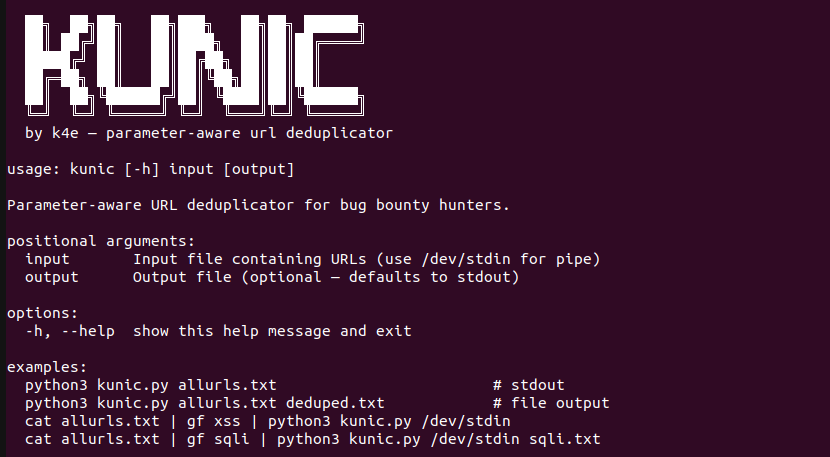

# kunic 🔍

> **Parameter-aware URL deduplicator for bug bounty hunters**

When you run `cat allurls.txt | gf xss > xss_endpoints.txt`, you end up with hundreds of duplicate URLs that share the exact same parameters — only the **values** differ. These duplicates are noise: they point to the same backend logic, the same injection point, the same potential vulnerability. Testing them wastes your time.

**kunic** solves this. It deduplicates URLs by their **parameter structure**, not their raw string. Two URLs with identical parameter keys but different values are treated as one — and only the first is kept.

---

## The Problem

```
https://target.com/search?q=hello&page=1     ← kept ✓
https://target.com/search?q=world&page=2     ← duplicate, removed ✗
https://target.com/search?q=test&page=99     ← duplicate, removed ✗
https://target.com/item?id=123&ref=home      ← kept ✓
https://target.com/item?id=456&ref=shop      ← duplicate, removed ✗
```

These all have the same parameter **keys** (`q + page`, `id + ref`) — only values change.
After `gf xss`, you'd test the same endpoint 3 times for nothing. kunic collapses them into one.

---

## How it works

- **Same base URL + same parameter keys** → keep only the first occurrence
- **Same base URL + different parameter keys** → treated as distinct endpoints (kept)
- **No parameters** → standard exact-match deduplication
- Order of parameters doesn't matter (`?a=1&b=2` == `?b=2&a=1`)

---

## Usage

```bash
# From file → file
python3 kunic.py allurls.txt deduped.txt

# From stdin → stdout (pipe-friendly)
cat allurls.txt | gf xss | python3 kunic.py /dev/stdin

# Full recon pipeline
cat allurls.txt | gf xss | python3 kunic.py /dev/stdin xss_endpoints.txt
cat allurls.txt | gf sqli | python3 kunic.py /dev/stdin sqli_endpoints.txt
cat allurls.txt | gf lfi  | python3 kunic.py /dev/stdin lfi_endpoints.txt
```

---

## Example

**Input** (11 URLs):
```
https://target.com/search?q=hello&page=1
https://target.com/search?q=world&page=2
https://target.com/search?q=test&page=99
https://target.com/item?id=123&ref=home
https://target.com/item?id=456&ref=shop
https://target.com/login
https://target.com/login
https://target.com/api?token=abc&user=john
https://target.com/api?token=xyz&user=jane
https://target.com/page?id=1
https://target.com/page?id=2&extra=foo
```

**Output** (6 URLs):
```
https://target.com/login
https://target.com/search?q=hello&page=1
https://target.com/item?id=123&ref=home
https://target.com/api?token=abc&user=john
https://target.com/page?id=1
https://target.com/page?id=2&extra=foo     ← kept: different param keys (id vs id+extra)
```

```
[✓] 11 URLs read → 6 kept (5 removed)
```

---

## Installation

```bash
git clone https://github.com/youruser/kunic
cd kunic
# No dependencies — uses Python 3 stdlib only
python3 kunic.py --help
```

---

## Compared to existing tools

| Tool | Dedup by param keys | Pipe-friendly | No deps |
|------|---|---|---|
| **kunic** | ✅ Core feature | ✅ | ✅ Python stdlib |
| `urldedupe` | ✅ Similar logic | ✅ | Rust binary |
| `undupify` | ✅ + heuristics | ✅ | Python |
| `uddup` | ⚠️ Pattern-based | ✅ | Python |
| `dedupe` | ✅ + extensions | ✅ | Go binary |
| `sort -u` | ❌ Exact match only | ✅ | — |

**Why kunic over the others?**

- **Zero dependencies** — pure Python 3, works anywhere without compiling or installing binaries
- **Focused scope** — does one thing and does it well, no config needed
- **gf-first design** — built specifically for the post-`gf` dedup problem in recon pipelines
- **Transparent** — prints exactly how many URLs were removed and why

---

## Integration with recon.sh

```bash
# After gf filtering, pipe through kunic before saving
cat allurls.txt | gf xss    | python3 kunic.py /dev/stdin params/xss_endpoints.txt
cat allurls.txt | gf sqli   | python3 kunic.py /dev/stdin params/sqli_endpoints.txt
cat allurls.txt | gf lfi    | python3 kunic.py /dev/stdin params/lfi_endpoints.txt
cat allurls.txt | gf rce    | python3 kunic.py /dev/stdin params/rce_endpoints.txt
cat allurls.txt | gf ssrf   | python3 kunic.py /dev/stdin params/ssrf_endpoints.txt
cat allurls.txt | gf idor   | python3 kunic.py /dev/stdin params/idor_endpoints.txt
```

---

## License

MIT — use freely, contribute back.

---

*Made by a bug bounty hunter, for bug bounty hunters.*
